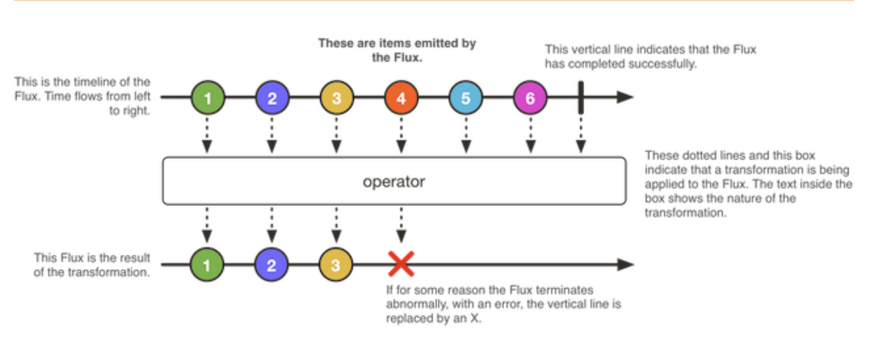
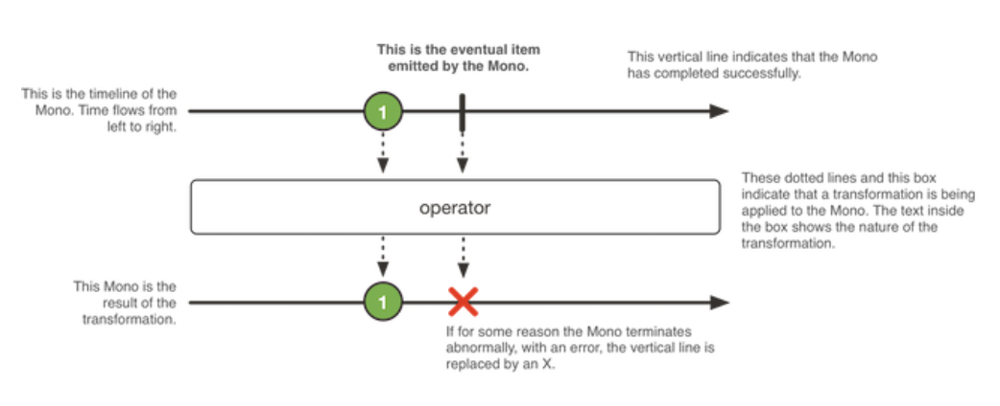

# Reactor

## Introduction

There are currently several programming paradigms; in this post we’ll discuss reactive programming which focuses on 
the asynchronous management of finite and infinite data flow. Reactor is a reactive programming library for 
the Java language which provides the basis for developing non-blocking applications, thus representing a change in how 
we think about an application’s execution model. Reactor was developed by Pivotal, a software and services company, 
which takes care of developments worldwide in different divisions of software engineering.

## What is Reactor?

To talk about Project Reactor we must first define what Reactive Programming is. It’s a paradigm or microarchitecture 
that involves the routing or consumption of Streams (data stream emitted over time). Data-flows and the propagation of 
changes that can be generated in the application can be analyzed, providing fast and consistent response times (responsive), 
remaining responsive to error situations (resilient) and to increasing workload(elastic) based on the exchange of 
asynchronous messages (oriented to messages). Reactive Programming follows the Observer design pattern which means that 
when an object’s status changes, the other objects are notified and updated, thus reducing the inefficient use of resources. 
More can be learned about this topic in the Programming Reactive documentation.

Within this conceptual frame of reactive programming, we can begin to examine Project Reactor. As mentioned above, 
this is a library that exhibits the following characteristics:

- Allows on-demand management in an efficient way from a totally non-blocking base.
- Has an appropriate architecture.
- Works very well for microservices.
- It’s also powerful enough to use on any system, responding to the massive multiple requests in HTTP, UDP and TCP in 
an asynchronous way known as backpressure.

Backpressure grants the Consumer of an asynchronous stream the ability to tell the Producer the amount of data that 
must be sent to prevent the issuance of events at a rate that is faster than the processing capabilities. 
Reactor provides several strategies to reduce the amount of data that gets sent, including engaging buffers and using 
the Windowing technique, that allows a program to analyze data from the last n seconds every m seconds.

Summing up, Project Reactor can maintain a high-performance message rate and also work with very low memory space. 
Thanks to these features it is suitable for creating efficient applications based on events. It allows these events 
to cope with more requests at the same time in an asynchronous way which is ideal for high-latency applications.

## Reactor Performance

The main artifact Project Reactor employs is reactor-core, which is a reactive library that focuses on the specification 
of reactive Streams and the Java 8 objectives. Reactor has two reactive types that implement the Publisher interface, 
but also provide a broad set of operators: Flux<T> and Mono<T>. These types allow applications to serve more requests 
at the same time and both support non-blocking backpressure.

There are standard or basic methods for its creation that are used by these operators, among which we find: 
create, defer and error.

### Flux

A Flux object represents a reactive sequence of 0 to N elements, and also allows the generation of sources from 
arbitrary callback types.

### Mono

A Mono object represents a single or empty value result (0..1) and allows deterministic generation from scratch or a 
sequence from arbitrary callback types.

### Schedulers

Reactor uses a Scheduler that determines the context for an execution of arbitrary tasks, providing the assurance 
required by a reactive Stream. We can also use or create efficient Schedulers for subscribeOn and publishOn. 
It’s possible to use multiple reactor instances that can be instantiated with different schedulers.

## Advantages and Drawbacks

### Advantages

We can answer many requests or call messages by generating one or a several threads.

It’s possible to do a callback asynchronously and this could potentially save us calling resources.

It achieves weak coupled programming and tends to isolate faults or errors, so it’s easily scalable, 
and you can anticipate the number of events it can receive.

With the efficient use of resources, we are doing much more with less. Specifically, we can process higher workloads 
with fewer threads.

### Drawbacks

More intensive memory usage is needed to store large data-flows as they are maintained for a long time.

It may be a little different from conventional programming, and it may be hard to understand in the beginning.

Most of the complexities must be dealt with at the time of declaring the service.

It doesn’t work well for applications that have very little data flow, as it can deem simple programming unnecessarily 
complex, or possibly even affect the performance.

## Conclusion

Although Reactor has only been around for a short time, it has achieved a great impact on applications that suffer from 
high latency, by allowing better processing and response performance. This makes it ideal for the programming world’s 
new trend, as well as zooming in and allowing reactive programming in Java.

On the other hand it’s proving to be a strong resource to handle all of the devices and applications connected to 
the Internet 24/7. We need to be able to show information almost instantaneously to millions of users which generates 
very intense loads. That’s why I see great potential in Reactor being able to respond in an optimal and correct way 
to these massive data demands, which means that the application responds as the user expects it.